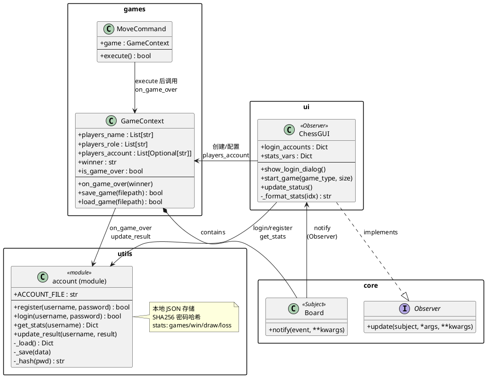
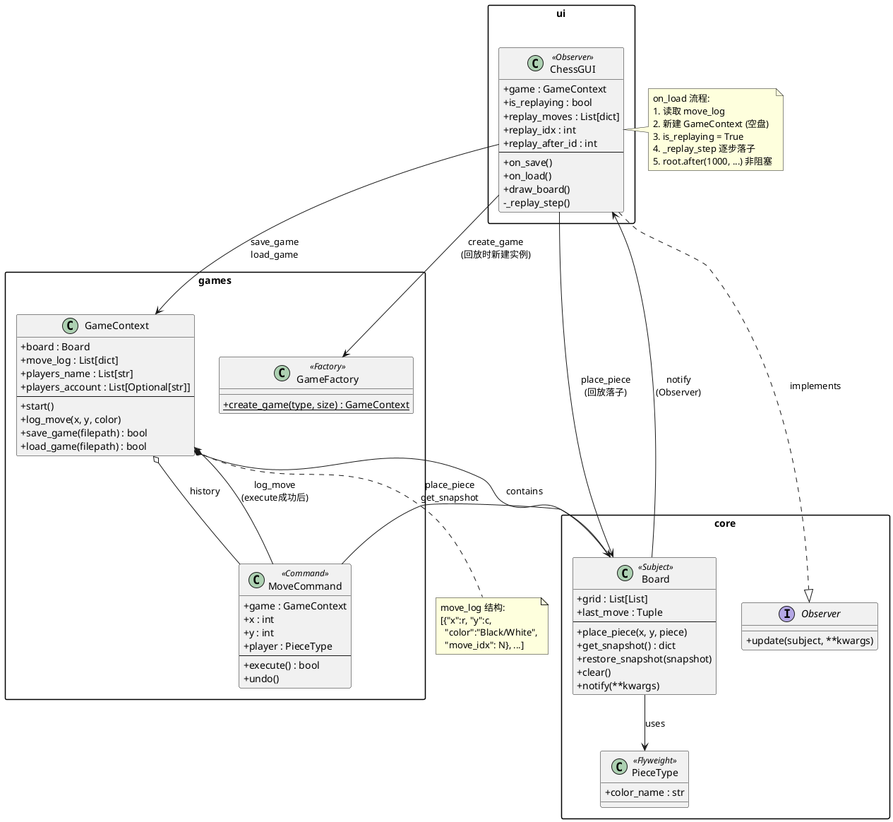
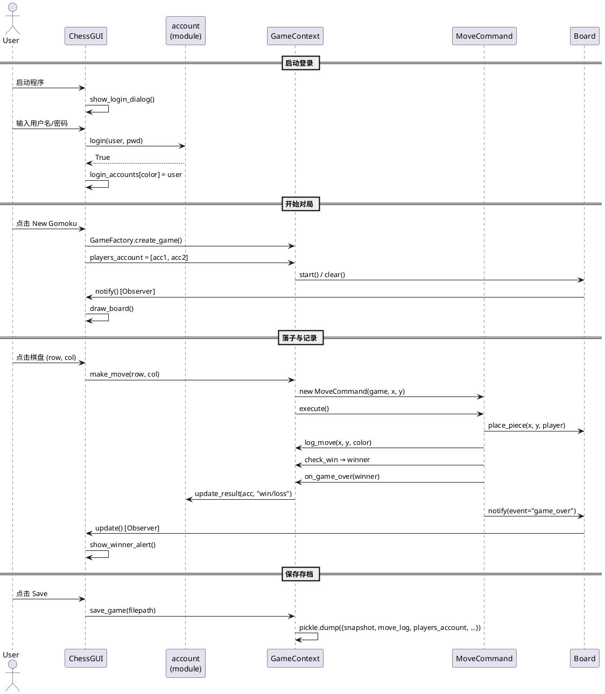

# Doc3：可选三级AI（MCTS）与 GUI 账户管理（第二阶段补充）

## 1. 需求重述（本次新增）
本次补充实现了第二阶段中的两个重点需求：其一是可选加分项的第三级 AI（使用蒙特卡洛树搜索 MCTS，为五子棋提供更强的自动落子能力，目标是在同等设置下稳定压制二级启发式 AI，并在与玩家对战时呈现更“像人”的决策）；其二是用户账户管理在 GUI 侧的完整落地，即在 GUI 打开时提供黑白双方的登录/注册入口，在对局过程中持续展示用户名与战绩（未登录显示游客，AI 显示 AI），并在对局结束后自动更新战绩，同时将用户账号信息与存档/录像文件关联，满足“可追溯”和“可统计”的要求。

## 2. 设计与关键类（扩展点最小侵入）
系统仍保持第一阶段的 MVC 变体与多模式组合：`GameContext/Board/RuleStrategy` 为模型层核心，GUI/CLI 作为视图/控制层，通过 `Observer` 监听棋盘变化。为了保证“增加功能后接口尽可能少变化”，本次新增功能均采用“新增类 + 增量字段 + 复用既有接口”的方式实现。

### 2.1 三级 AI：`GomokuMCTS`
第三级 AI 实现于 `games/ai.py`，核心类为 `GomokuMCTS`，对外暴露与一级/二级 AI 完全一致的接口 `select_move(game)->(x,y)`，因此平台能够“无差异地对待玩家/AI/不同等级 AI”。实现采用简化 MCTS：
- **Selection**：使用 UCT（Upper Confidence Bound applied to Trees）在已扩展子节点中选择下一步；
- **Expansion**：对当前节点生成合法落子集合并创建子节点；
- **Simulation/Rollout**：从扩展后的局面开始随机落子直到终局（或满盘判平）；
- **Backpropagation**：将仿真结果沿路径回传，统计 visits 与 wins（平局按 0.5 计）。

该实现通过 `simulations`（默认 400）限制计算量，保证交互性；当游戏类型不是五子棋时，MCTS 自动退化为随机 AI，保证系统健壮性与接口统一性。

### 2.2 GUI 账户管理：登录/注册 + 战绩展示 + 结果更新
账户模块复用 `utils/account.py`（本地 JSON 存储，SHA256 密码哈希）。GUI 侧在启动时弹出 Toplevel 对话框，分别为 Black/White 提供“游客/登录/注册”选项与用户名密码输入。登录成功后将用户名写入 `players_account` 与 `players_name`，对局结束后由 `GameContext.on_game_over()` 自动更新胜/负/平统计。为了确保 UI 能在 game_over 弹窗出现前看到最新战绩，`MoveCommand` 在触发 `game_over` 通知之前先调用 `on_game_over` 完成战绩写回。

右侧控制面板增加战绩展示区，持续显示：
- **登录用户**：显示“场次/胜/平/负”；
- **游客**：显示“游客”；
- **AI**：显示“AI”。

### 2.3 存档/录像与账号关联
存档结构在原 `save_game()` 的基础上扩展字段，保持向后兼容：
- `players_name`：显示名（登录用户名/Guest-Black/AI 等）；
- `players_account`：用于战绩归属（未登录为 None）；
- `move_log`：步序录像（用于 GUI/CLI 回放）。

因此录像文件天然与账号信息关联：同一份存档可回放并显示当时对局双方身份；若双方为登录用户，则该对局结算会写入对应账户的战绩统计文件。

## 3. 使用方式

### 3.1 GUI（推荐）
运行：
```bash
python -m chess_platform.main
```

启动后会弹出“用户登录/注册”窗口：
- Black/White 可分别选择：游客 / 登录 / 注册；
- 登录/注册成功后，对局右侧会显示对应用户名与战绩；
- 若将角色选择为 `ai-rand` / `ai-pro` / `ai-mcts`，则该方显示为 AI，并不会参与账号战绩统计。

选择对局：
- 右侧选择 `New Gomoku / New Go / New Othello` 开局；
- 五子棋中可将任意一方设置为 `ai-mcts` 体验三级 AI；
- 对局结束后系统会自动更新登录账号的战绩，并在右侧刷新显示。

存档/回放：
- Save 会保存局面 + `move_log` + `players_account`；
- GUI Load 会自动进入回放模式（从空盘按 1s/步重放），并显示存档携带的玩家信息。

### 3.2 CLI（可选）
运行：
```bash
python -m chess_platform.main --cli
```
在玩家配置中可选择 4 = `AI-MCTS（五子棋三级）`，并可进行登录/注册；使用 `replay <file>` 可回放步序。

## 4. 测试要点（建议）
1) 五子棋：将 Black 设为 `ai-mcts`，White 设为 `ai-pro`，多次对局观察胜率（应明显优于二级启发式）。  
2) 账户：注册两个账号对战，结束后重新登录查看 `games/win/draw/loss` 递增是否正确。  
3) 存档关联：用登录账号完成对局并保存，Load 回放时检查右侧展示是否为保存时的用户名/战绩；同时确认未登录方显示游客、AI 方显示 AI。  

## 5. 相关文件
- 三级 AI：`chess_platform/games/ai.py`（`GomokuMCTS`）
- GUI 登录与战绩：`chess_platform/ui/gui.py`
- 战绩存储：`chess_platform/utils/account.py`
- 结算更新：`chess_platform/games/logic.py`

---

## 6. 类图（PlantUML）

### 6.1 登录与战绩功能类图

该类图展示账户管理模块与整体项目的交互关系：GUI 启动时通过 `account` 模块完成登录/注册，游戏过程中 `GameContext` 持有玩家账户信息，终局时调用 `account.update_result` 更新战绩，GUI 通过 `account.get_stats` 拉取并展示战绩。



### 6.2 录像与回放功能类图

该类图展示录像与回放机制：`MoveCommand.execute` 成功后调用 `log_move` 记录落子；`save_game` 将 `move_log` 与快照一起序列化；`on_load` 读取后进入回放模式，由 `_replay_step` 按步序驱动棋盘重现。



### 6.3 整体交互时序（登录 → 对局 → 战绩更新 → 保存）



